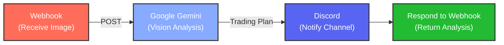
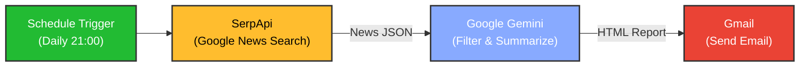
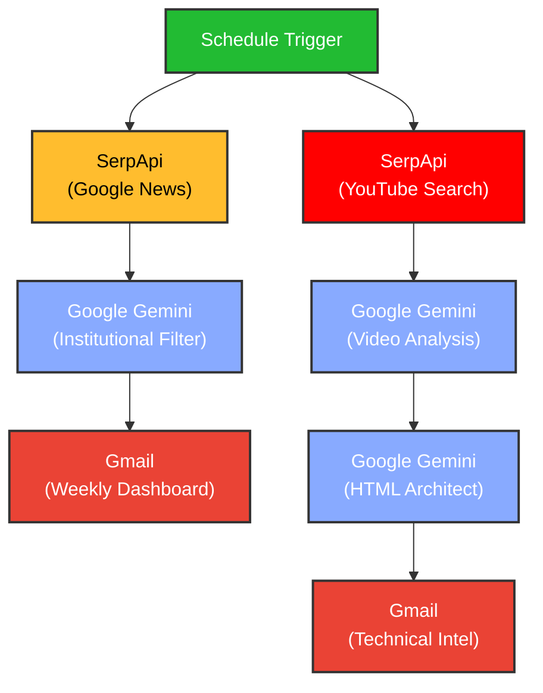

# N8N AI Automation Workflows

This repository contains exported workflows for **n8n**, focusing on AI-powered automation using Google Gemini. These workflows demonstrate how to integrate LLMs with external services like Discord, Gmail, and Google Search to automate intelligence gathering and analysis tasks.

## Workflows

### 1. Chrome Extension Backend with AI (Trading Assistant)
**File:** `chrome extension backend with AI.json`

This workflow acts as a backend service for a Chrome extension (or any webhook client) to analyze financial charts using computer vision and advanced prompt engineering.

#### Workflow Diagram

#### Details
*   **Trigger:** Webhook (`POST`) receiving an image/screenshot.
*   **AI Logic:** Uses **Google Gemini** (Vision capabilities) with a "Hedge Fund CIO" persona. It performs a "Quantamental" analysis combining technical analysis (market structure, order flow) with a "Red Team" stress test to provide a balanced trading plan.
*   **Output:**
    *   Sends a structured analysis (Direction, Entry, Stop Loss, Take Profit, Reasoning) to a **Discord** channel.
    *   Returns the analysis text to the webhook caller.

---

### 2. SI-OS Intel Daily Collection (Daily News Summarizer)
**File:** `SI-OS Intel Daily Collection DATA Summarizer and sent to my Gamil (Gemini Edition).json`

A daily scheduled automation that acts as a personal "Chief Intelligence Officer," scraping financial news and generating a high-quality HTML summary email.

#### Workflow Diagram

#### Details
*   **Trigger:** Scheduled Timer (Daily at 21:00).
*   **Process:**
    1.  **Search:** Uses **SerpApi** to fetch the latest Google News results for "financial" topics.
    2.  **Filter & Summarize:** Uses **Google Gemini** to process the raw search results. It filters specifically for **Macro Economics**, **Crypto**, and **AI Tech**, ensuring news is within the last 24 hours.
    3.  **Format:** Generates a clean, styled HTML report with an executive summary and categorized links.
*   **Output:** Sends the HTML report via **Gmail**.

---

### 3. Project Crypto ChainLink News Broadcast
**File:** `Project_Crypto_ChainLinkNews_boardcast.json`

A sophisticated dual-track intelligence workflow that monitors the Chainlink ecosystem, combining news aggregation with deep technical video analysis.

#### Workflow Diagram

#### Details
*   **Trigger:** Scheduled periodic execution.
*   **Dual-Track Intelligence:**
    1.  **News Track:** Filters Google News for high-signal institutional developments (CCIP, RWA, ETF, Swift integrations) using **Google Gemini**.
    2.  **Video Track:** Analyzes official **Chainlink YouTube** videos to extract technical deltas, performance metrics, and strategic positioning.
*   **AI Logic:** Employs specialized personas (Lead Institutional Strategist and System Architect) to ensure professional, objective, and high-signal reporting.
*   **Output:** Sends two types of reports via **Gmail**:
    *   **Weekly Strategic Dashboard:** A curated list of the top 10 institutional-grade news items.
    *   **Technical Intelligence:** In-depth deconstruction of the latest technical updates.

---

## Setup & Usage

1.  **Install n8n:** Ensure you have an n8n instance running (Cloud or Self-hosted).
2.  **Import Workflows:**
    *   Open your n8n dashboard.
    *   Click **"Add Workflow"** -> **"Import from..."** -> **"Local File"**.
    *   Select the `.json` files from this directory.
3.  **Configure Credentials:**
    You will need to set up the following credentials in n8n for these workflows to function:
    *   **Google Gemini (PaLM) API:** For the AI analysis and summarization.
    *   **Discord Webhook URL:** For the trading bot notifications.
    *   **SerpApi Key:** For the Google News search functionality.
    *   **Gmail OAuth2:** For sending the daily email reports.

## Disclaimer
The "Chrome Extension Backend with AI" workflow generates financial analysis based on AI interpretation of charts. This is for educational and informational purposes only. **Do not use this as financial advice.** Always do your own research (DYOR).
